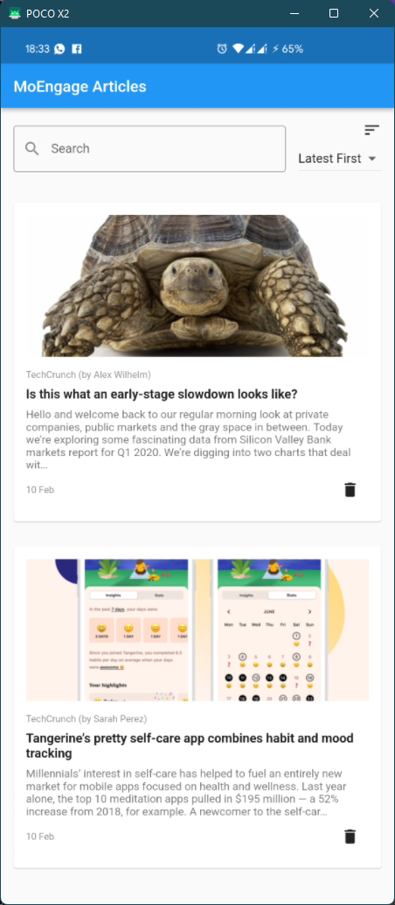

# moengage_task

A sample task project for MoEngage

## Features

- Loads articles from provided API
- Search by publisher/author/title of articles
- Sort by date (newest first/oldest first)
- Offline mode support
- Users can save articles offline
- Offline Database is encrypted with AES Encryption
- Connectivity-aware UI
- Simple, clean UI
- Made in 3.5hours

## Screenshot

## Download
Download the APK file from the [Releases Section](https://github.com/shripal17/moengage_task/releases)
